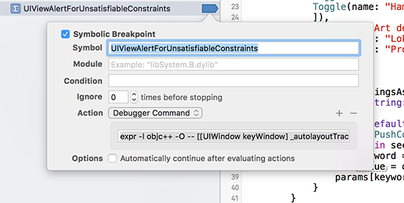
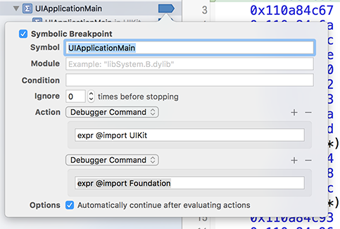
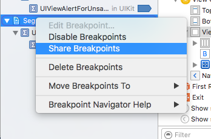

#Lightning Talk about "Avoiding String Identifiers in Swift"
I read about this type of `segueIdentierForSegue(_:)` in [Florian Kugler's & Daniel Eggert's book "obcj - Core Data"](https://www.objc.io/books/core-data/). They recommend watching the [WWDC 2015 - Swift in Practice](https://developer.apple.com/videos/play/wwdc2015-411/) talk, where the idea and the code examples are taken from. Natasha wrote about this WWDC-Talk, too and gives a good overview about it [Natasha The Robot - Protocol-Oriented Segue Identifiers in Swift](http://natashatherobot.com/protocol-oriented-segue-identifiers-swift/)

Breakpoint-Tips from our [CocoaheadsFFM](http://cocoaheadsffm.github.io/cocoaheadsffm/) Meetup in January 2016 that were previously shown at [Andreas Wittmann](https://twitter.com/anwittmann)'s and [Florian Bachmann](https://twitter.com/florianbachmann)'s [iOS Programming with Swift](https://github.com/iosprogrammingwithswift/iosprogrammingwithswift) course 🤓

# Autolayout Errors - WTF?
	Unable to simultaneously satisfy constraints.
	Probably at least one of the constraints in the following list is one you don't want.
	Try this:
	
	(1) look at each constraint and try to figure out which you don't expect;
	(2) find the code that added the unwanted constraint or constraints and fix it.
	(Note: If you're seeing NSAutoresizingMaskLayoutConstraints that you don't understand, refer to the documentation for the UIView property translatesAutoresizingMaskIntoConstraints)
	
	(...........)
	
	
	Make a symbolic breakpoint at UIViewAlertForUnsatisfiableConstraints to catch this in the debugger.
	The methods in the UIConstraintBasedLayoutDebugging category on UIView listed in <UIKit/UIView.h> may also be helpful.
	
# Auto Layout Breakpoints - FTW!

Symbol:

`UIViewAlertForUnsatisfiableConstraints`

Action:

`expr -l objc++ -O -- [[UIWindow keyWindow] _autolayoutTrace]`

#Auto Layout Breakpoints to find ambigous layouts

	UIWindow:0x7f9481c93360
	|   •UIView:0x7f9481c9d680
	|   |   *UIView:0x7f9481c9d990- AMBIGUOUS LAYOUT for UIView:0x7f9481c9d990.minX{id: 13}, UIView:0x7f9481c9d990.minY{id: 16}
	|   |   *_UILayoutGuide:0x7f9481c9e160- AMBIGUOUS LAYOUT for _UILayoutGuide:0x7f9481c9e160.minY{id: 17}
	|   |   *_UILayoutGuide:0x7f9481c9ebb0- AMBIGUOUS LAYOUT for _UILayoutGuide:0x7f9481c9ebb0.minY{id: 27}
	
Sometimes it is hard to find the breaking constraint 🤔

One trick is do change the background color of the views involved 🤓

	(lldb) expr ((UIView *)0x7f9ea3d43410).backgroundColor = [UIColor redColor]
	(UICachedDeviceRGBColor *) $1 = 0x00007f9ea3d43410

#Breakpoints - Auto Import UIKit
typing `p UIScreen.mainScreen.bound` in the console gives us an error, because of the missing UIKit import of LLDB.

	(lldb) p UIScreen.mainScreen.bound
	error: property 'mainScreen' not found on object of type 'UIScreen'
	error: 1 errors parsing expression

Breakpoints are able to import UIKit automatically (Foundation is imported by UIKit)

Symbol:

`UIApplicationMain`

Action:

`expr @import UIKit`

Hint: `Don't miss the Àutomatically continue after evaluating actions` checkbox 

That removes the previous error 👍
	
	(lldb) p UIScreen.mainScreen.bounds
	(CGRect) $1 = (origin = (x = 0, y = 0), size = (width = 414, height = 736))

#Share Breakpoints with your Coworkers 
Nobody has to type them a second time. 👏

Thanks [@tonklon](https://twitter.com/tonklon) for this :-)
